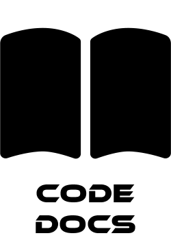

	

	
 	

	
	
	

	<a href="https://discord.gg/ss220">
		<picture>
			<source media="(prefers-color-scheme: dark)" srcset=".github/assets/discord-light.png">
			<source media="(prefers-color-scheme: light)" srcset=".github/assets/discord-dark.png">
			
		</picture>
	</a>
	<a href="https://docs.cm-ss13.com">
		<picture>
			<source media="(prefers-color-scheme: dark)" srcset=".github/assets/docs-light.png">
			<source media="(prefers-color-scheme: light)" srcset=".github/assets/docs-dark.png">
			
		</picture>
	</a>
	<a href="https://cm-ss13.com">
		<picture>
			<source media="(prefers-color-scheme: dark)" srcset=".github/assets/website-light.png">
			<source media="(prefers-color-scheme: light)" srcset=".github/assets/website-dark.png">
			
		</picture>
	</a>
	<a href="https://cm-ss13.com/wiki">
		<picture>
			<source media="(prefers-color-scheme: dark)" srcset=".github/assets/wiki-light.png">
			<source media="(prefers-color-scheme: light)" srcset=".github/assets/wiki-dark.png">
			
		</picture>
	</a>

> [!IMPORTANT]
> CM-SS13 cannot be compiled exclusively using BYOND - **you must use our build tool**.
> Firstly, you need to install [BYOND](https://www.byond.com/download/), and run the `bin/server.cmd` file to start the server.
> You can learn more in our [Installation Guide](tools/build/README.md). **Building colonialmarines in DreamMaker directly is now deprecated and will cause errors.**

CM-SS13 is a game based on [Space Station 13](https://spacestation13.com), made in [BYOND](https://www.byond.com). CM-SS13 has wildly adapted the SS13 model into a strategic roleplay-based team deathmatch game.

# Useful Links

- ## [Setting up a Development Environment](https://cm-ss13.com/wiki/Guide_to_Git)
> [!TIP]
> Want to contribute for the first time but unsure where to start? Take a look at our community maintained [Guide to Contributing](https://cm-ss13.com/wiki/Contributing_to_the_Game)!

This guide will get you set up with a Visual Studio Code development environment, complete with BYOND debugger, which will allow you to contribute back to this repository.

- ## [Contributing Rules](.github/CONTRIBUTING.md)
This is our canonical, maintainer-maintained contributing guide, which contains information on our maintainer team structure and pull request rules.

- ## [Code Standards](.github/guides/STANDARDS.md)
Our standards documents details how to structure your code to comply with CM-SS13 code standards, and provides some information on DreamMaker quirks.

- ## [Code Style](.github/guides/STYLES.md)
The styles document tells you how to style your code to match the rest of the code in our codebase.

- ## [tgui README](tgui/README.md)
All new interfaces in CM must be created using tgui - this document will help get you set up for tgui development.

# Licenses

### 
> The code for CM-SS13 is licensed under the [GNU Affero General Public License v3](http://www.gnu.org/licenses/agpl.html). All code is assumed to be licensed under AGPL v3 unless stated otherwise by file header, or this document.

### 
> Assets including icons and sound are under the [Creative Commons 3.0 BY-SA license](https://creativecommons.org/licenses/by-sa/3.0/) unless otherwise indicated. Authorship for assets including art and sound under the CC BY-SA license is defined as the active development team of CM-SS13 unless stated otherwise (by author of the commit).

### 
> Commits before [9a001bf520f889b434acd295253a1052420860af on Mon, 14 Sep 2020 09:13:32 +0000](https://github.com/cmss13-devs/cmss13/commit/9a001bf520f889b434acd295253a1052420860af) are assumed to be licensed under [GNU General Public License v3](https://www.gnu.org/licenses/gpl-3.0.html) and can be used in closed source repositories.
